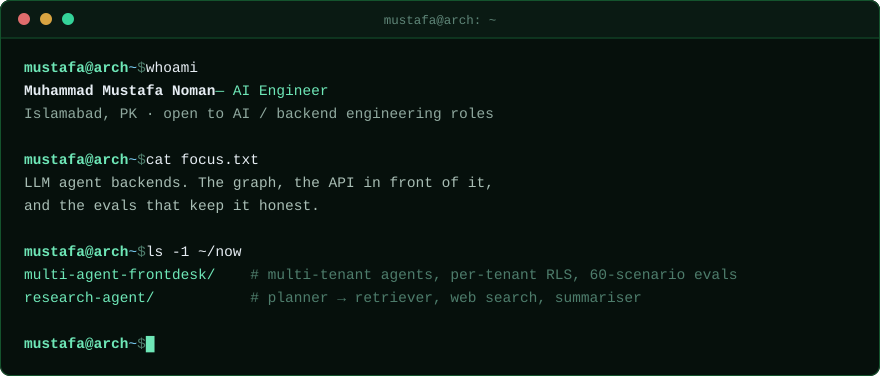

<h1 align="center">Muhammad Mustafa Noman</h1>

  <b>AI Engineer</b> · multi-agent backends, RAG pipelines, and the APIs around them 
  <a href="https://treemustafa.com">treemustafa.com</a> &nbsp;·&nbsp;
  <a href="https://linkedin.com/in/mustafanoman">LinkedIn</a> &nbsp;·&nbsp;
  <a href="mailto:mnipk1243@gmail.com">mnipk1243@gmail.com</a>

  

  <a href="https://github.com/striderr1o1/Multi-Agent-Frontdesk"><b>Multi-Agent-Frontdesk</b></a> — a multi-tenant agent
  platform. An orchestrator routes between a Pinecone RAG agent and a booking agent on a LangGraph loop, with per-tenant
  vector namespaces and row-level security, SSE streaming, and a 60-scenario regression suite over the routing decisions. 
  <a href="https://striderr1o1.github.io/operations-copilot-js/">live</a> &nbsp;·&nbsp;
  <a href="https://www.youtube.com/watch?v=WkthJS-O92c">build vlog</a> &nbsp;·&nbsp;
  <a href="mailto:mnipk1243@gmail.com">mnipk1243@gmail.com</a>

  <b>Recently</b> — Product Builder (intern) at insite.life, an early-stage UK startup, remote. 
  <b>Ask me about</b> — LangGraph orchestration, RAG that survives real documents, multi-tenant FastAPI, writing evals for agents.

---

### Tech

<table>
  <tr>
    <td valign="middle" nowrap><b>Languages</b></td>
    <td valign="middle">
        
        
        
        
        
    </td>
  </tr>
  <tr>
    <td valign="middle" nowrap><b>AI &amp; Agents</b></td>
    <td valign="middle">
        
        
        
        
        
        
        
    </td>
  </tr>
  <tr>
    <td valign="middle" nowrap><b>Model providers</b></td>
    <td valign="middle">
        
        
        
        
        
        
    </td>
  </tr>
  <tr>
    <td valign="middle" nowrap><b>Backend &amp; data</b></td>
    <td valign="middle">
        
        
        
        
        
        
        
        
    </td>
  </tr>
  <tr>
    <td valign="middle" nowrap><b>Frontend</b></td>
    <td valign="middle">
        
        
        
        
        
    </td>
  </tr>
  <tr>
    <td valign="middle" nowrap><b>Infra &amp; tools</b></td>
    <td valign="middle">
        
        
        
        
        
        
        
    </td>
  </tr>
</table>

---

### Projects

| Project | What it does | Stack |
| --- | --- | --- |
| **[Multi-Agent Frontdesk](https://github.com/striderr1o1/Multi-Agent-Frontdesk)** [live](https://striderr1o1.github.io/operations-copilot-js/) · [build vlog](https://www.youtube.com/watch?v=WkthJS-O92c) | A business uploads its documents and opens its bookable slots; its customers get one URL to chat with. An orchestrator routes each turn between a RAG agent and a booking agent on a LangGraph loop, with per-tenant vector namespaces and row-level security, SSE streaming, email-confirmed bookings, and a 60-scenario eval suite over the routing decisions. | FastAPI · LangGraph · Supabase · Pinecone · Docker |
| **[Research Agent](https://github.com/striderr1o1/research-agentai-backend)** | A planner node breaks a query into discrete tasks and fans them out to a PDF-retriever node and a Tavily web-search node; a summariser folds the insights into one answer. Exposed twice — blocking, and a streaming endpoint that emits each node's output as it executes, so the UI shows progress instead of a spinner. | FastAPI · LangGraph · Groq · Tavily · React |
| **[RAG with ElevenLabs](https://github.com/striderr1o1/RAG-with-ElevenLabs)** | Ask a city-information bot out loud and hear it answer. A tool-calling LLM picks between retrieval over ChromaDB and a live Tavily search, wrapped in speech-to-text and ElevenLabs text-to-speech. | FastAPI · ChromaDB · Groq · ElevenLabs · Tavily |
| **[AI Grocery Expense Tracker](https://github.com/striderr1o1/Grocery-List-Summarizer)** | Photos of handwritten grocery receipts in, categorised spending out. Gemini extracts the text, Groq classifies each item, and MongoDB keeps a per-user history you can chart over time. | Streamlit · Gemini · Groq · MongoDB |

---

### Links

  <a href="https://treemustafa.com">Website</a> &nbsp;·&nbsp;
  <a href="https://linkedin.com/in/mustafanoman">LinkedIn</a> &nbsp;·&nbsp;
  <a href="mailto:mnipk1243@gmail.com">Email</a>

<i>“Coding with purpose”</i>

