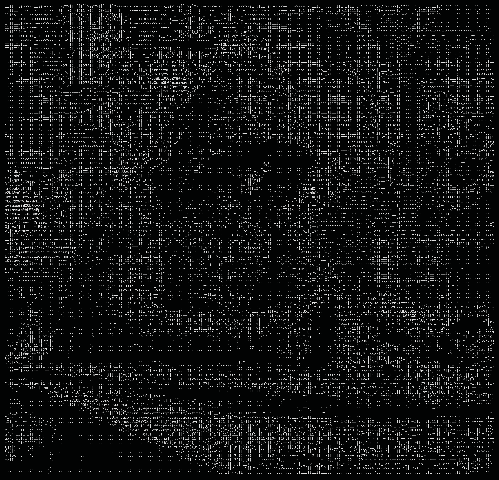

<h1 align="center">Muhammad Mustafa Noman</h1>

AI/Backend Engineer · Building AI-powered apps · CS student

<table>
  <tr>
    <td width="42%" valign="middle">
      
    </td>
    <td width="58%" valign="middle">
      <h3>About</h3>
      <ul>
        <li>Computer Science student</li>
        <li>Self-taught full stack dev focused on <b>Backend and Generative AI</b> — RAG, agents, and LLM apps</li>
        <li>Comfortable across the stack: <b>React · FastAPI · MongoDB · supabase</b>, with <b>LangChain / LangGraph</b> for the AI side</li>
        <li>Ask me about AI agents, RAG pipelines, or full stack builds</li>
        <li>Reach me: <b>mnipk1243@gmail.com</b></li>
      </ul>
    </td>
  </tr>
</table>

---

### Tech

**Languages** &nbsp;&nbsp; Python · JavaScript · C++ · C · HTML · CSS

**Frontend & Backend** &nbsp;&nbsp; React · FastAPI · MongoDB · supabase · PostGRESQL  

**AI / Agents** &nbsp;&nbsp; LangChain · LangGraph· LangSmith · CrewAI · chromaDB · Pinecone · Advanced RAG · OpenRouter · Groq · Gemini · Claude Code 

**Tools** &nbsp;&nbsp; Linux · Git · GitHub · Docker · Redis · Pydantic

---

### Projects

| Project | What it does | Stack |
| --- | --- | --- |
| **AI Operations Copilot** | Multi-agent orchestration for knowledge base operations and room booking within an organization | FastAPI · LangGraph · supabase · Pinecone|
| **AI Grocery Expense Tracker** | Tracks grocery spending with AI-powered insights | React · FastAPI |
| **Voice AI with RAG** | Voice-driven assistant that answers from your own knowledge base | Python · LangChain · RAG |
| **Research Agent** | Autonomous agent that gathers and synthesizes research | LangGraph · Python |
| **Natural Language → SQL** | Turns plain-English questions into SQL queries | Python · LLMs |
| **Notebooks Note App** | Full stack note-taking app with notebook organization | React · FastAPI · MongoDB |
| **TCP Server** | Low-level networking server written from scratch | C |
| **Restaurant Management System** | OOP-based management system | C++ |

---

### Links

  <a href="https://linkedin.com/in/mustafanoman">LinkedIn</a> &nbsp;·&nbsp;
  <a href="mailto:mnipk1243@gmail.com">Email</a>

<i>“Coding with purpose”</i>

